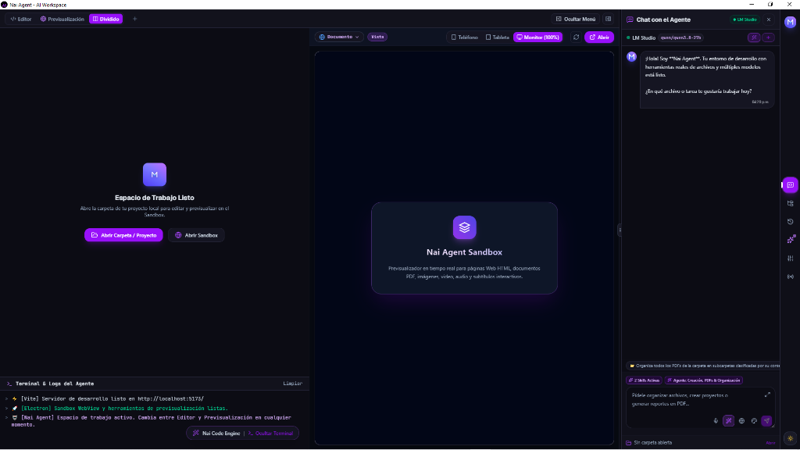
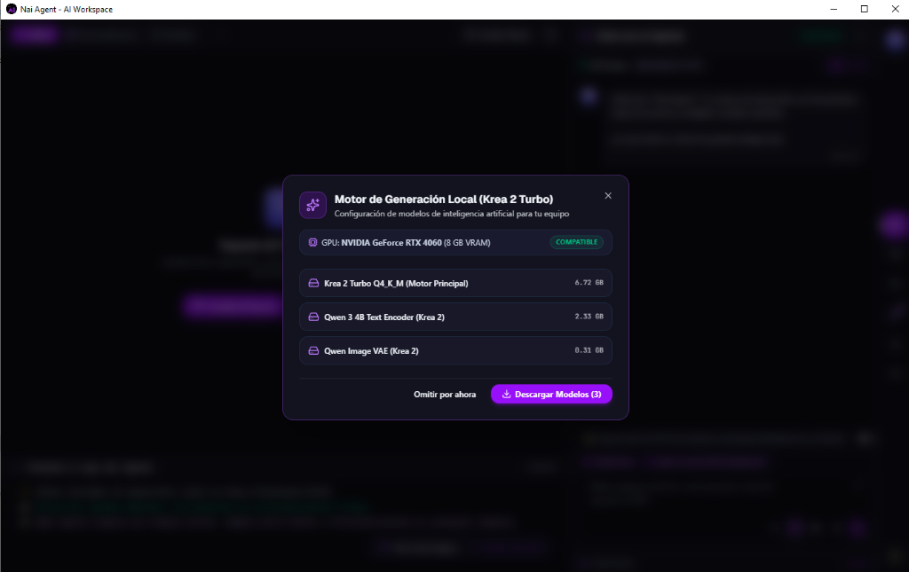

<div align="center">

# 🤖 Nai Agent — Desktop AI Agent Workspace

**El entorno de escritorio profesional de IA con ejecución autónoma, edición de archivos, multimedia, sandbox en tiempo real y generación local de imágenes.**

<p align="center">
  
  
  
  
  
  
  
</p>

</div>

---

## 🖥️ Vista General de la Interfaz

<p align="center">
  
</p>

* **Editor y Previsualizador Dividido**: Espacio de trabajo simultáneo para código, páginas Web HTML, documentos PDF, imágenes y video.
* **Chat con el Agente**: Asistente inteligente con herramientas reales de sistema de archivos, habilidades autónomas y conexión a múltiples modelos.
* **Terminal y Logs en Vivo**: Supervisión de tareas en tiempo real y consola integrada.

---

## ⚡ ¿Qué es Nai Agent?

**Nai Agent** no es solo un chat con IA: es un **agente autónomo de escritorio con acceso directo a tu espacio de trabajo local**. Puede leer, entender, crear y modificar archivos de todo tipo, analizar imágenes, documentos y videos, transcribir audios con Whisper local, ejecutar y previsualizar código en vivo, automatizar tareas multimedia con FFmpeg y generar imágenes en ultra alta fidelidad mediante inferencia local acelerada por GPU (Vulkan/Metal).

---

## 🎯 Capacidades y Funcionalidades del Agente

### 🗂️ 1. Gestión Autónoma del Espacio de Trabajo y Archivos
* **Creación y Modificación de Archivos**: Crea código, scripts, documentos Markdown, configuraciones JSON, etc., directamente en tu carpeta de proyecto.
* **Organización del Proyecto**: Renombra, mueve, crea carpetas o clasifica archivos automáticamente según las instrucciones que le des.
* **Lectura y Contexto Completo**: Lee automáticamente el contenido de los archivos de tu proyecto para ayudarte a programar, depurar o redactar con contexto real.

---

### 📄 2. Análisis Multimodal de Documentos, Imágenes y Videos
* **Lectura Profunda de PDFs**: Extrae y analiza informes, manuales y libros PDF de múltiples páginas para responder preguntas o generar resúmenes.
* **Visión por Computadora**: Analiza capturas de pantalla, diagramas e imágenes que adjuntes al chat.
* **Inspección de Archivos Multimedia**: Reconoce formatos de video y audio en tu carpeta para procesarlos automáticamente.

---

### 🎙️ 3. Transcripción y Automatización Multimedia Local
* **Transcripción de Voz / Video a Texto**: Reconocimiento de voz local con modelos Whisper ONNX (`@xenova/transformers`) 100% offline.
* **Generación de Subtítulos (`.srt` / `.vtt`)**: Genera subtítulos sincronizados a partir de videos o audios en tu espacio de trabajo.
* **Traducción de Subtítulos**: Traduce archivos de subtítulos existentes entre múltiples idiomas con un solo comando.
* **Edición Rápida con FFmpeg**: Une múltiples clips de video (`concat_videos`), recorta fragmentos (`cut_video`) o extrae pistas de audio (`extract_audio`).

---

### 💻 4. Entorno de Desarrollo y Sandbox en Tiempo Real
* **Previsualizador Interactivo (Live Sandbox)**: Visualiza al instante aplicaciones web (HTML, CSS, JavaScript, React, Tailwind CSS) generadas por el agente.
* **Editor de Código con Resaltado de Sintaxis**: Edita y navega entre archivos abiertos con pestañas interactivas.
* **Exportador de Reportes a PDF**: Convierte el contenido generado o tus documentos directamente a formato PDF ejecutivo.

---

### 🎨 5. Generación de Imágenes 100% Local (Krea 2 Turbo + Wan 2.1 VAE)

<p align="center">
  
</p>

* **Inferencia Local por GPU**: Motor nativo `stable-diffusion.cpp` (`sd-cli`) optimizado con Vulkan (Windows/Linux) y Metal (macOS).
* **Arquitectura de Modelos de Vanguardia**:
  * **Diffusion**: `Krea-2-Turbo-Q4_K_M.gguf` (Modelo Flow DiT de 8 pasos ultrarrápido).
  * **Text Encoder**: `qwen3vl_4b_fp8_scaled.safetensors` (Codificador multimodal Qwen 3).
  * **VAE Oficial**: `wan_2.1_vae.safetensors` (Decodificación de alta fidelidad sin artefactos).
* **100% Privado y Offline**: Tus prompts e imágenes nunca salen de tu computadora; no utiliza APIs externas de terceros.
* **Proporciones Nativas**: Relaciones de aspecto exactas en `16:9` (1024x576), `1:1` (896x896 / 768x768), `9:16`, `4:3` y `3:4`.
* **Administrador de Modelos Integrado**: Descarga y verifica el estado de los modelos con un solo clic desde la interfaz.

---

### 🌐 6. Integraciones y Mensajería
* **Canales de Notificación**: Envía mensajes y archivos directamente a **Telegram**, **Discord** y **WhatsApp**.
* **Almacenamiento en la Nube**: Sincronización y copias de seguridad en **Google Drive** y **Dropbox**.

---

## 🔌 Proveedores de Modelos de IA Compatibles

Nai Agent te da la libertad de elegir el cerebro de tu agente, conectando proveedores locales o remotos:

| Proveedor | Tipo | Modelos Compatibles / Ejemplos |
| :--- | :---: | :--- |
| 🦙 **Ollama** | Local / Privado | Llama 3.3, DeepSeek R1, Qwen 2.5, Mistral, Gemma 2, Phi-3 |
| 🧪 **LM Studio / vLLM** | Local (OpenAI-compatible) | Cualquier modelo GGUF o servidor local en el puerto `1234` |
| 🌐 **OpenRouter** | Nube (Multi-modelo) | Claude 3.7 Sonnet, DeepSeek V3, GPT-4o, Llama 3.3 70B |
| ⚡ **Groq** | Nube (Ultra Rápido) | Llama 3.3 70B Versatile, Mixtral 8x7B, Gemma 2 |
| 🧠 **OpenAI / Anthropic** | Nube | GPT-4o, GPT-4.5, Claude 3.5 / 3.7 Sonnet |
| 🔷 **Google Gemini** | Nube | Gemini 2.0 Flash, Gemini 1.5 Pro |

---

## 📥 Descarga e Instalación para Usuarios

Descarga los instaladores listos para usar desde la sección de **[Releases](https://github.com/arturoobezo/Nai_Agent/releases)** o en la pestaña **Actions**:

### 🪟 Windows (10 / 11)
1. Descarga el paquete `Nai-Agent-Windows-Installer.zip` o el ejecutable `Nai Agent Setup.exe`.
2. Ejecuta el instalador. Se creará un acceso directo en tu escritorio e inicio.

### 🍎 macOS (Apple Silicon M1/M2/M3/M4 & Intel)
1. Descarga el paquete `Nai-Agent-macOS-Installer.zip`.
2. Abre el archivo `.dmg` y arrastra **Nai Agent** a tu carpeta de **Aplicaciones**.
3. *Nota*: La primera vez, haz clic derecho sobre la app y selecciona **"Abrir"** para autorizar la ejecución.

### 🐧 Linux (Ubuntu, Debian, Fedora, Arch)
1. Descarga el archivo `.AppImage` o el paquete `.deb`.
2. En `.AppImage`, dale permisos de ejecución: `chmod +x Nai-Agent-*.AppImage` y ejecútalo.
3. En `.deb`, instala con: `sudo dpkg -i nai-agent_*.deb`.

---

## 🛠️ Guía para Desarrolladores (Clonar y Modificar)

Si deseas clonar el proyecto, personalizar la interfaz o agregar tus propias herramientas:

```bash
# 1. Clonar el repositorio
git clone https://github.com/arturoobezo/Nai_Agent.git
cd Nai_Agent

# 2. Instalar dependencias
npm install

# 3. Iniciar en modo desarrollo (Vite + Electron con Hot-Reload)
npm run dev

# 4. Compilar instaladores para producción
npm run dist:win     # Genera el instalador NSIS (.exe) para Windows
npm run dist:mac     # Genera el instalador DMG y ZIP para macOS
npm run dist:linux   # Genera AppImage y paquete .deb para Linux
npm run dist:all     # Genera todos los instaladores simultáneamente
```

---

## 🏗️ Estructura del Código

```text
Nai_Agent/
├── .github/workflows/    # Automatización CI/CD (GitHub Actions)
├── docs/images/          # Capturas y recursos gráficos de la documentación
├── electron/             # Proceso principal (IPC, Filesystem, GPU, FFmpeg, Whisper)
│   ├── main.js           # Backend central y orquestador de herramientas
│   └── preload.js        # ContextBridge seguro para la interfaz
├── src/                  # Frontend de la aplicación (React 19 + Tailwind CSS v4)
│   ├── components/       # Chat, Editor, Sandbox, Explorer, Modales, ModelSetup
│   ├── context/          # Estados globales (Workspace, AI, Theme, Skills, Chats)
│   └── main.jsx          # Punto de entrada de la UI
├── scripts/              # Scripts de verificación offline, descarga de modelos
├── public/               # Iconos y recursos visuales
└── package.json          # Dependencias y configuración de empaquetado multi-OS
```

---

## 📄 Licencia

Este proyecto está bajo la **Licencia MIT**. Eres libre de usarlo, modificarlo y distribuirlo para fines personales o comerciales.