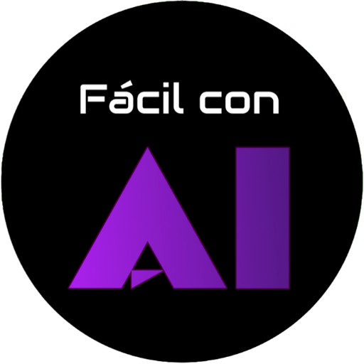

# 🚀 Nai Agent - Workspace de Inteligencia Artificial & Agente Autónomo

<p align="center">
  
</p>

<p align="center">
  <strong>Un entorno de trabajo de escritorio inteligente para desarrolladores, creadores y entusiastas de la IA.</strong><br>
  Inferencia local de imágenes con Krea 2 Turbo, ejecución de código en vivo (Sandbox), soporte para múltiples LLMs y herramientas multimedia nativas.
</p>

<p align="center">
  
  
  
  
  
  
</p>

---

## 🌟 Características Principales

### 🎨 1. Generador de Imágenes de Alta Fidelidad (Krea 2 Turbo)
- **Generación Local con GPU**: Soporte para modelos GGUF optimizados (`Krea-2-Turbo-Q4_K_M.gguf` y `Qwen 3 4B`).
- **Aspect Ratios Nativos**: Generación sin distorsiones en `16:9` (1280x768), `9:16` (768x1280), `1:1` (1024x1024), `4:3`, `3:4` alineados a múltiplos de 64 píxeles.
- **Generación en Lote**: Produce de 1 a 4 imágenes con parámetros de calidad y semillas estocásticas independientes.
- **Menú de Acción Rápida**: Abre la imagen generada en el visor de tu sistema, descárgala o copia su ruta con un clic.

### 🤖 2. Conectividad con Proveedores de IA (LLMs)
Nai Agent te permite conectar prácticamente cualquier proveedor local o en la nube:
- 🦙 **Ollama** (Modelos locales 100% privados: Llama 3, DeepSeek, Qwen, Mistral, Gemma).
- 🧪 **LM Studio / vLLM / TextGen WebUI** (Servidores locales compatibles con OpenAI API).
- 🌐 **OpenRouter** (Acceso a cientos de modelos: Claude 3.7 Sonnet, DeepSeek R1, GPT-4o, Llama 3.3).
- ⚡ **Groq** (Inferencia ultra rápida en la nube).
- 🧠 **OpenAI / Anthropic / Google Gemini / Mistral AI**.

### 💻 3. Sandbox de Código en Tiempo Real
- Previsualizador interactivo para proyectos web (HTML, CSS, JavaScript, React, Tailwind).
- Editor de código integrado con explorador de archivos completo.
- Exportación directa de reportes y documentos a formato **PDF**.

### 🎬 4. Herramientas Multimedia Nativas
- **Transcripción de Audio y Video**: Whisper local para convertir voz a texto.
- **Generación y Traducción de Subtítulos**: Creación automática de archivos `.srt` y traducción instantánea.
- **Edición Rápida con FFmpeg**: Unión y recorte de videos directamente desde el chat.

---

## 📥 Descarga e Instalación para Usuarios

Puedes descargar la última versión compilada desde la sección de **[Releases](https://github.com/arturoobezo/Nai_Agent/releases)** o en la pestaña de **Actions**:

### 🪟 Windows (10 / 11)
1. Descarga el archivo `Nai-Agent-Windows-Installer.zip`.
2. Descomprime el archivo y ejecuta el instalador `Nai Agent Setup.exe`.
3. Sigue las instrucciones en pantalla. ¡Listo! Se creará un acceso directo en tu escritorio.

### 🍎 macOS (Apple Silicon M1/M2/M3/M4 & Intel)
1. Descarga `Nai-Agent-macOS-Installer.zip`.
2. Abre el archivo `.dmg` y arrastra **Nai Agent** a tu carpeta de **Aplicaciones**.
3. *Nota*: La primera vez que lo abras, haz clic derecho sobre la aplicación y selecciona **"Abrir"** para autorizar la ejecución.

---

## 🛠️ Guía para Desarrolladores (Clonar y Modificar)

Si deseas clonar el proyecto, personalizarlo o añadir nuevas funciones:

### Prerrequisitos
- [Node.js](https://nodejs.org/) (versión 20 o superior recomendada).
- [Git](https://git-scm.com/).

### 1. Clonar el repositorio
```bash
git clone https://github.com/arturoobezo/Nai_Agent.git
cd Nai_Agent
```

### 2. Instalar dependencias
```bash
npm install
```

### 3. Iniciar en modo desarrollo
```bash
npm run dev
```
Esto levantará el servidor de desarrollo de Vite con recarga en vivo (HMR) y abrirá la ventana de Electron.

### 4. Compilar localmente
- Para compilar en Windows:
  ```bash
  npm run dist:win
  ```
- Para compilar en macOS:
  ```bash
  npm run dist:mac
  ```

Los instaladores resultantes se guardarán en la carpeta `release/`.

---

## ⚙️ Configuración de Proveedores de IA

Para configurar tus modelos y APIs:
1. Abre **Nai Agent** y haz clic en el ícono de **Configuración / Proveedores** en la barra lateral.
2. Selecciona tu proveedor preferido:
   - **Ollama**: Asegúrate de tener Ollama corriendo (`http://localhost:11434`) y selecciona el modelo instalado.
   - **LM Studio**: Inicia el servidor local en LM Studio (`http://localhost:1234/v1`).
   - **OpenRouter / OpenAI / Groq**: Ingresa tu clave de API (API Key) y el modelo deseado.
3. Guarda la configuración y empieza a chatear o crear imágenes.

---

## 🏗️ Estructura del Proyecto

```text
Nai_Agent/
├── .github/workflows/    # Flujos CI/CD de GitHub Actions (Compilación automática)
├── electron/             # Proceso principal de Electron (IPC, GPU, llamadas a IA, FS)
│   ├── main.js           # Orquestador del backend de Electron
│   └── preload.js        # Puente seguro de contexto (ContextBridge)
├── src/                  # Interfaz de usuario (React 19 + Tailwind CSS)
│   ├── components/       # Componentes visuales (Chat, Editor, Sandbox, Modales)
│   ├── context/          # Contextos de estado (AI, Workspace, Temas, Skills)
│   └── main.jsx          # Punto de entrada de React
├── public/               # Iconos y recursos estáticos
└── package.json          # Configuración de dependencias y electron-builder
```

---

## 📄 Licencia

Este proyecto está bajo la Licencia MIT. Eres libre de usarlo, modificarlo y distribuirlo comercial o personalmente.
